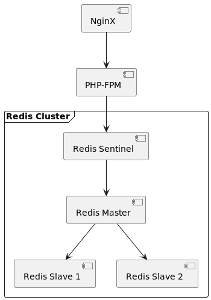

## HSA. Homework 12. NoSQL Databases: Redis

---

The goals of the project:

1. Build redis cluster with redis sentinel.
2. Implement probabilistic caching to avoid [cache stampede](https://en.wikipedia.org/wiki/Cache_stampede)

### Architecture


### Setup

Run setup script

```bash
./setup
```

### Benchmark Commands

Classical caching:

```bash
./benchmark [concurrency:10] [time in seconds:30]
```

Probabilistic caching:

```bash
./benchmark-prob [concurrency:10] [time in seconds:30]
```

### Benchmarks results

Concurrency: 10  
Execution Time: 30s  
Computation time: 3s
> Computation time is execution time of the function which result we want to cache

| Parameter                   | Classical caching | Probabilistic caching |
|-----------------------------|-------------------|-----------------------|
| Transactions                | 2165 hits         | 2799 hits             |
| Availability                | 100.00 %          | 100.00 %              |
| Elapsed time                | 29.15 secs        | 29.69 secs            |
| Data transferred            | 0.06 MB           | 0.07 MB               |
| Response time               | 0.12 secs         | 0.11 secs             |
| Transaction rate            | 74.27 trans/sec   | 94.27 trans/sec       |
| Concurrency                 | 8.97              | 9.93                  |
| Successful transactions     | 2165              | 2799                  |
| Failed transactions         | 0                 | 0                     |
| Longest transaction         | 3.13              | 3.12                  |
| Shortest transaction        | 0.06              | 0.06                  |
| **Heavy task computations** | **30**            | **19**                |
| **Cache stampedes**         | **3**             | **1**                 |

> The one cache stampede was present only on startup

### Conclusion
The probabilistic caching technique allows:
* decrease number of cache stampedes (or even avoid them with cache warmup).
* decrease number of cache re-computation.
* increase transaction rate
