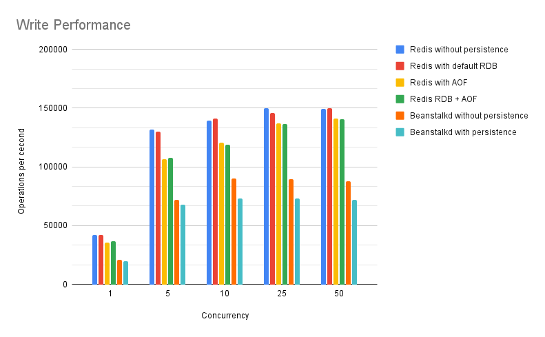
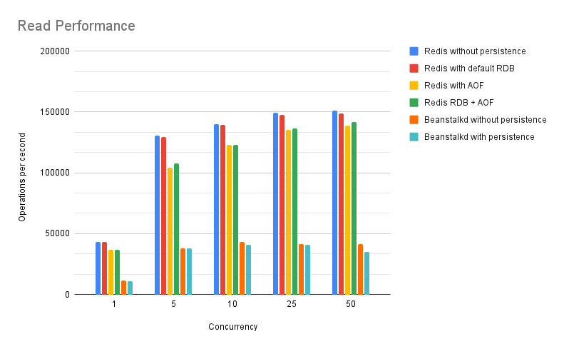

## HSA. Homework 13. Queues

The goal of the project is to benchmark performance of Redis and Beanstalkd queues.  
It is done with own `multi-thread` benchmark tool written in `php`.  
The benchmarking process is split out two parts: writing and reading.  

The benchmarking strategy is to load queue systems over some certain time with different currencies. 

### Installation
```bash
docker compose up -d
docker compose exec php composer install
```

### Benchmarking tool
```bash
docker compose exec php php benchmark.php <concurrency> <time> <path-to-scenario>
```
Example:
```bash
dc exec php php benchmark.php 10 60 ./scenario/BeanstalkdRead.php
```

### Benchmarks results:

Benchmark time: 60s

#### Write performance

|                                | 1     | 5      | 10     | 25     | 50     |
|--------------------------------|-------|--------|--------|--------|--------|
| Redis without persistence      | 42168 | 131728 | 139118 | 150035 | 149627 |
| Redis with default RDB         | 41893 | 130181 | 140878 | 145674 | 149960 |
| Redis with AOF                 | 35776 | 106682 | 120875 | 136990 | 140987 |
| Redis RDB + AOF                | 36530 | 107573 | 119083 | 136246 | 140552 |
| Beanstalkd without persistence | 21041 | 71692  | 89972  | 89693  | 87699  |
| Beanstalkd with persistence    | 19778 | 67607  | 73296  | 73221  | 71815  |



#### Read performance

|                                | 1     | 5      | 10     | 25     | 50     |
|--------------------------------|-------|--------|--------|--------|--------|
| Redis without persistence      | 43343 | 130404 | 140104 | 149118 | 151255 |
| Redis with default RDB         | 43439 | 129322 | 139624 | 147577 | 148736 |
| Redis with AOF                 | 36892 | 104103 | 122994 | 135208 | 138668 |
| Redis RDB + AOF                | 36631 | 107574 | 123143 | 136622 | 141602 |
| Beanstalkd without persistence | 11713 | 38080  | 43204  | 41690  | 41191  |
| Beanstalkd with persistence    | 10999 | 37684  | 40622  | 40718  | 34810  |


