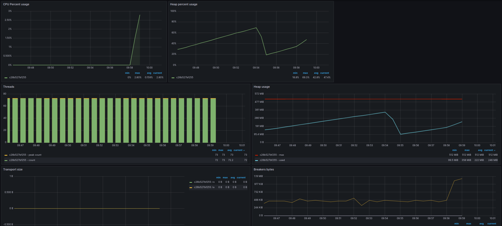
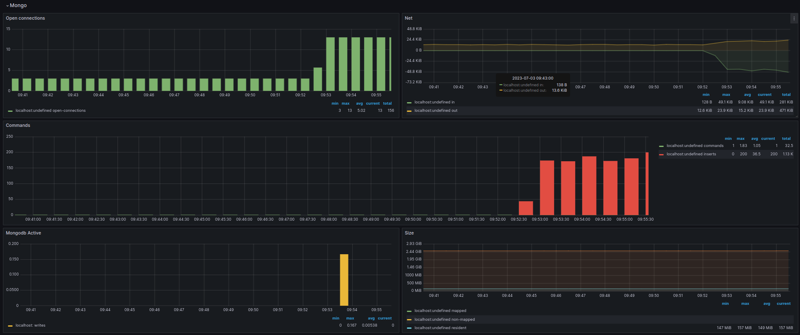

## HSA. Homework3. Resource monitoring

The goal of the project is to build the monitoring system on top
of dummy web-app.

The web-app stack:
* nginx
* php-fpm
* elasticsearch
* mongodb

The monitoring stack:
* telegraf
* influxdb
* grafana

### Prerequisites
```
Docker
```

### Installation
Just run the script from the root of the repository:
```bash
./setup
```

### System loading
To load the system the following scripts can be used:
```bash
./bin/load_elastic.sh [concurrency:50] [repeats:10]
./bin/load_mongo.sh [concurrency:50] [repeats:10]
```
where arguments `concurrency` and `repeats` are optional

### Monitoring
The monitoring dashboards can be found at `http://localhost:3000/`
with credentials:  
username: `admin`  
password: `admin`

#### Elasticsearch


#### Mongodb

