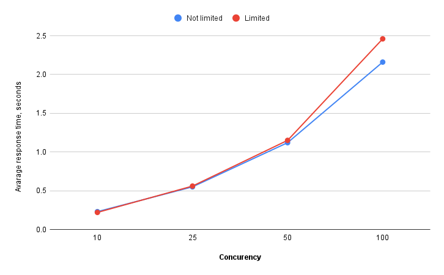

## HSA. Homework5. Stress Testing. Approaches and tools

The symfony web app is loaded by `siege` benchmark tool.  

App stack:
* nginx
* php-fpm
* mysql

### Setup
```bash
./setup
```

### Benchmarking
```bash
./benchmark [concurency] [repeats]
```

### Results
Number of repeats during each performed benchmark - 100.  

Each step consists of:
* POST request for `task` creation
* Being redirected to the same page but with `GET` method
* Get web page with form and last `50` created `tasks`

|Concurency:|10|25|50|100|
|---|---|---|---|---|
|Transactions:|2000 hits|5000 hits|10000 hits|20000 hits|
|Availability:|100.00 %|100.00 %|100.00 %|100.00 %|
|Elapsed time:|46.48 secs|111.38 secs|224.14 secs|432.94 secs|
|Data transferred:|6.18 MB|15.56 MB|31.19 MB|62.38 MB|
|Response time:|0.23 secs|0.55 secs|1.12 secs|2.16 secs|
|Transaction rate:|43.03 trans/sec|44.89 trans/sec|44.61 trans/sec|46.20 trans/sec|
|Throughput:|0.13 MB/sec|0.14 MB/sec|0.14 MB/sec|0.14 MB/sec|
|Concurrency:|9.9|24.88|49.83|99.71|
|Successful transactions:|2000|5000|10000|20000|
|Failed transactions:|0|0|0|0|
|Longest transaction:|0.54|1.03|2.2|3.14|
|Shortest transaction:|0.13|0.11|0.15|0.14|


### The same but with containers memory limitations:
* php-fpm: 200MB
* nginx: 15MB
* MySQL: 150MB

|Concurency:|10|25|50|100|
|---|---|---|---|---|
|Transactions:|2000 hits|5000 hits|10000 hits|20000 hits|
|Availability:|100.00 %|100.00 %|100.00 %|100.00 %|
|Elapsed time:|45.34 secs|112.32 secs|230.15 secs|494.58 secs|
|Data transferred:|6.18 MB|15.56 MB|31.19 MB|62.38 MB|
|Response time:|0.22 secs|0.56 secs|1.15 secs|2.46 secs|
|Transaction rate:|44.11 trans/sec|44.52 trans/sec|43.45 trans/sec|40.44 trans/sec|
|Throughput:|0.14 MB/sec|0.14 MB/sec|0.14 MB/sec|0.13 MB/sec|
|Concurrency:|9.84|24.87|49.82|99.65|
|Successful transactions:|2000|5000|10000|20000|
|Failed transactions:|0|0|0|0|
|Longest transaction:|0.51|1|1.76|3.57|
|Shortest transaction:|0.11|0.11|0.11|0.18|


