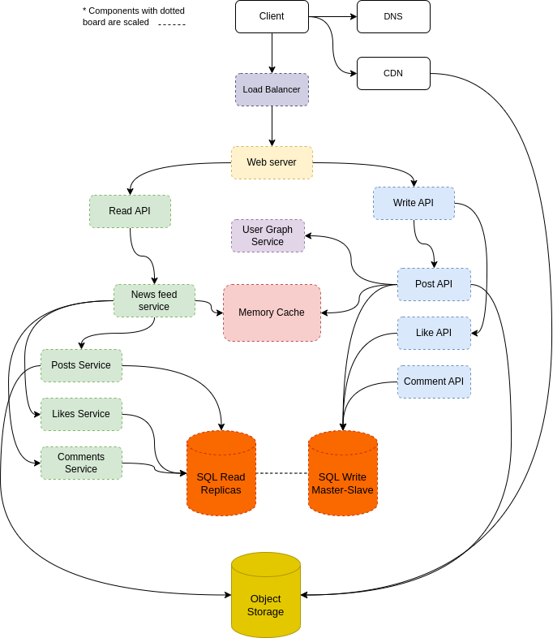

# HSA. Homework 7. High load application architecture

## Subject:
* Design the instagram news feed 
* Posts might contain photos and videos
* Design post's and likes and comments functionality

## Usecase
* **User** publish post
* **User** likes a post
* **User** comments a post
* **User** views the user posts (activity from the user)
* **User** views the news feed (activity from people the user is following)

### Constraints and assumptions

#### General
* Publishing **post** should be fast
* 135 million active users
* 500 million publications per day or 15 billion publications per month
  - Each **post** delevered to 10 followers in average.
  - 5 billion total **posts** delivered per day
  - 150 billion **posts** delivered month
  - 250 billion read requests per month


#### News feed
* Viewing the news feed should be fast 
* Instagram is more read heavy than write heavy
* Optimize for fast reads of posts

## High-level architecture diagram


## Design Core Components
#### Use case: **User** publish post
The post might be stored in relational database.
When user create post it must be delivered to the all of his followers.
The query to the relational db for that will be something like:
```sql
select posts.*, users.* from posts
join users      on posts.author_id       = users.id
join followers  on followers.followee_id = users.id
where followers.follower_id = current_user
```
which will be extremely slow on big data tables.  

The alternative might be to store the news feed posts ids for each user in **Memory Cache**.  

**Post** publication flow:
1. User creates a post.
2. The request is forwarded to the **Web Server** by **Load Balancer**
3. The request is forwarded from the **Web Server** to **Write API**
4. The request is forwarded from the **Write API** to **Post API**
5. **Post API** stores **post** in relational database.
6. **Post API** asks **User Graph Service** for followers of post's author.
7. **Post API** add post_id to each follower in **Memory Cache**
8. **Post API** stores post media to **Object Storage**

#### Use case: **User** likes a post
1. User likes a post.
2. The request is forwarded to the **Web Server** by **Load Balancer**
3. The request is forwarded from the **Web Server** to **Write API**
4. The request is forwarded from the **Write API** to **Like API**
5. **Like API** stores **like** in relational database

#### **User** comments a post
1. User creates a **comment**.
2. The request is forwarded to the **Web Server** by **Load Balancer**
3. The request is forwarded from the **Web Server** to **Write API**
4. The request is forwarded from the **Write API** to **Comment API**
5. **Comment API** stores **comment** in relational database

#### Use case: **User** views the user timeline
1. User views another user posts.
2. The request is forwarded to the **Web Server** by **Load Balancer**
3. The request is forwarded from the **Web Server** to **Read API**
4. The request is forwarded from the **Read API** to **New Feed Service**
5. The request is forwarded from the **Read API** to **New Feed Service**
6. **New Feed Service** takes all posts with likes and comments of concrete user
from relational database via **Posts Service**, **Likes Service** and **Comments Service**. O(n)
7. The media of the posts might be delivered from CDN. 

#### Use case: **User** views the news feed
1. User views a news feed.
2. The request is forwarded to the **Web Server** by **Load Balancer**
3. The request is forwarded from the **Web Server** to **Read API**
4. The request is forwarded from the **Read API** to **New Feed Service**
5. **New Feed Service** takes news feed posts ids of current user from **Memory Cache**. O(1)
6. **New Feed Service** takes these posts with likes and comments
from relational database via **Posts Service**, **Likes Service** and **Comments Service**. O(n)
7. The media of the posts might be delivered from CDN.
