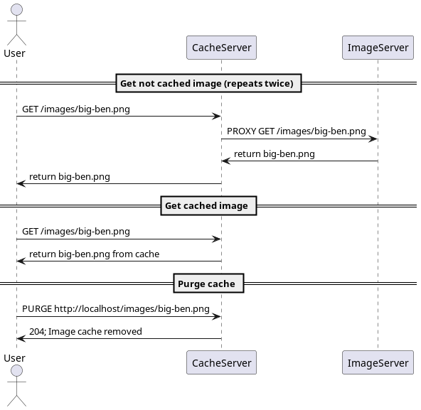

## HSA. Homework8. Web Servers

Images caching with `nginx` web server.



```bash
curl -i -X GET "http://localhost/images/big-ben.png"

curl -X PURGE -D - "http://localhost/images/big-ben.png"  
curl -X PURGE -D - "http://localhost/images/*"
```
